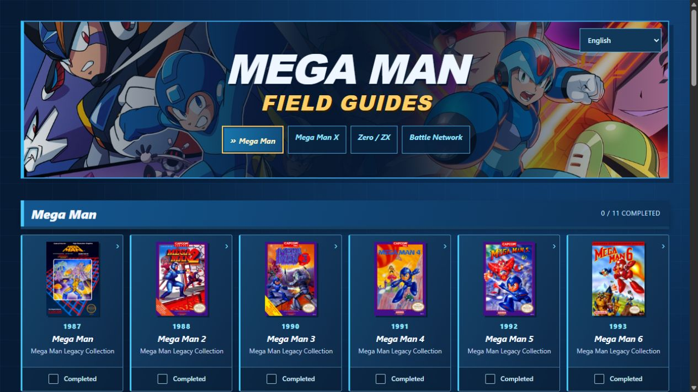
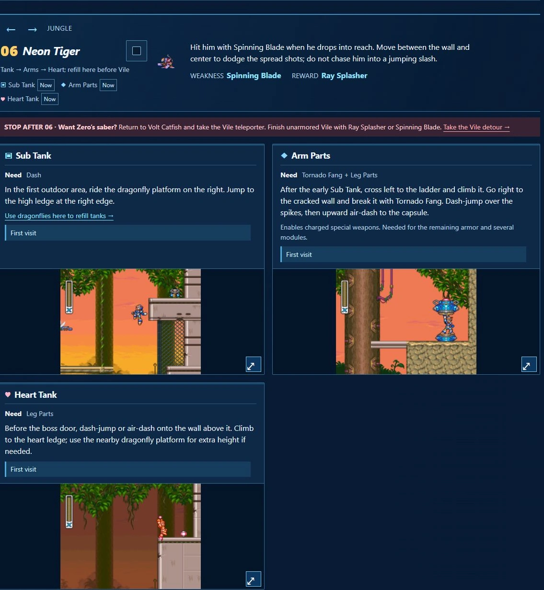
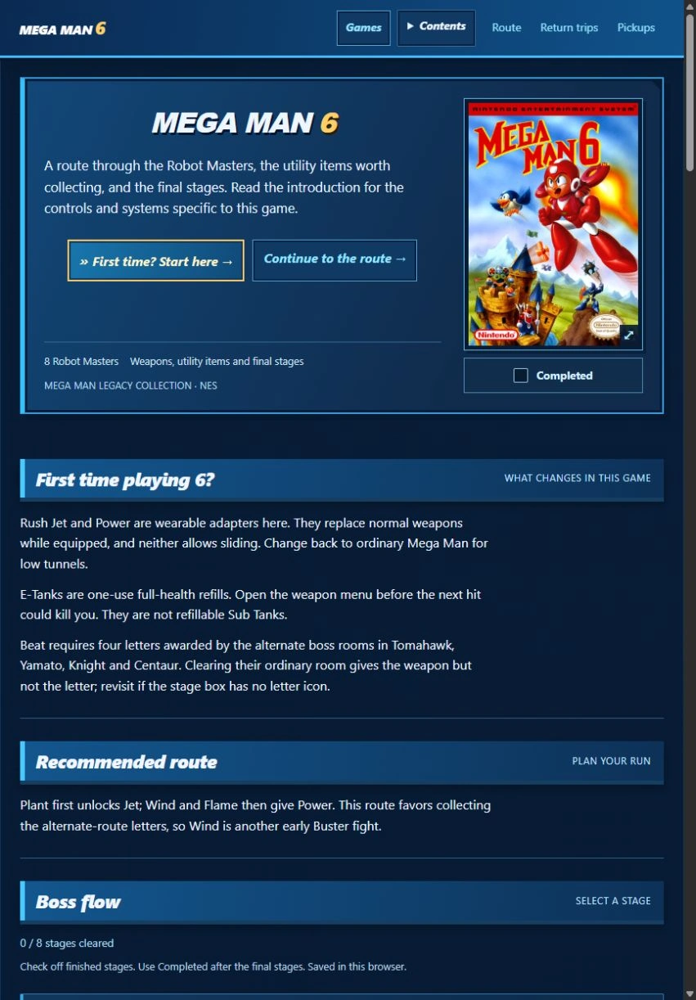

# Mega Man Field Guides

Boss order, upgrades and the details easy to miss while playing.

## [Open the guides →](https://zertrax.github.io/megaman-x-guides/)

Free to use in your browser. No account, installation or ads.

### Choose your language

[English](https://zertrax.github.io/megaman-x-guides/?lang=en) · [Español (Latinoamérica)](https://zertrax.github.io/megaman-x-guides/es-MX/) · [Português (Brasil)](https://zertrax.github.io/megaman-x-guides/pt-BR/) · [日本語](https://zertrax.github.io/megaman-x-guides/ja/) · [简体中文](https://zertrax.github.io/megaman-x-guides/zh-Hans/) · [Français](https://zertrax.github.io/megaman-x-guides/fr/) · [Deutsch](https://zertrax.github.io/megaman-x-guides/de/) · [Русский](https://zertrax.github.io/megaman-x-guides/ru/)

Use the language menu in any guide. Your choice is remembered, and changing languages keeps your completion marks and reading section. Screenshots and in-game names stay English so you can match the guide to the pictures. The translations are AI-assisted and have targeted checks; they have not had a full native-speaker review.

### Pick your series

| Open a collection | Games covered |
| --- | --- |
| **[Mega Man →](https://zertrax.github.io/megaman-x-guides/#classic)** | Mega Man 1–11 · both Legacy Collections and Mega Man 11 |
| **[Mega Man X →](https://zertrax.github.io/megaman-x-guides/#x)** | X1–X8 · separate X and Zero guides for X4 |
| **[Zero / ZX →](https://zertrax.github.io/megaman-x-guides/#zero)** | Zero 1–4, ZX and ZX Advent |
| **[Battle Network →](https://zertrax.github.io/megaman-x-guides/#network)** | Battle Network 1–6 · all ten game/version campaigns in both Legacy Collection volumes |

**36 guides**, with routes suited to each game. Battle Network follows story chapters, chips and customization; the platform games follow stages, bosses and pickups.

### Keep it beside the game

- **Start with the basics.** Each guide explains the controls, upgrades and systems that change from game to game.
- **Know what comes next.** Follow the boss route, check weaknesses and rewards, and watch for warnings about choices you cannot undo.
- **Find what you missed.** Pickup directions state what you need and when to return. Return trips group the remaining items by stage.
- **Check a picture quickly.** Enlarge screenshots inside the guide, then close them to continue reading. Movement videos load only when selected.
- **Make it yours.** Check off cleared stages and finished games. The guide remembers your place when you reopen it.

*Inside the [Mega Man X3 guide](https://zertrax.github.io/megaman-x-guides/x3/#neon-tiger): requirements, directions and location pictures together.*

<strong>A look at the introduction</strong>

Each game begins with a short introduction. [Mega Man 6](https://zertrax.github.io/megaman-x-guides/mm6/), for example, explains its Rush adapters, E-Tanks and alternate routes for Beat.

Your progress stays in this browser. It does not sync between devices, and clearing this site's browser data removes it. Completion marks are reversible; they do not track individual pickups.

### About the guides

This is an independent fan project. Mega Man and its artwork belong to Capcom. Screenshots, sprites and reference material are credited at the bottom of each guide.

Routes and locations are cross-checked with the linked references; they have not been tested through complete playthroughs. Some pickups have written directions without a picture. Full chip-code, Cyber-Elf and Secret Disk catalogues are linked where useful.

Found a mistake or an unclear instruction? [Open an issue](https://github.com/zertrax/megaman-x-guides/issues) with the game, stage, guide language and what needs correcting.

The [previous X1–X8 website](https://zertrax.github.io/megaman-x-guides/previous/) remains available for comparison.

<strong>Code, local preview and publishing</strong>

See [Development and publishing](docs/development.md) for setup, source-file organization and deployment. [Verification notes](docs/verification.md) record the checks and their limits; [STATE.md](STATE.md) records the current release.

